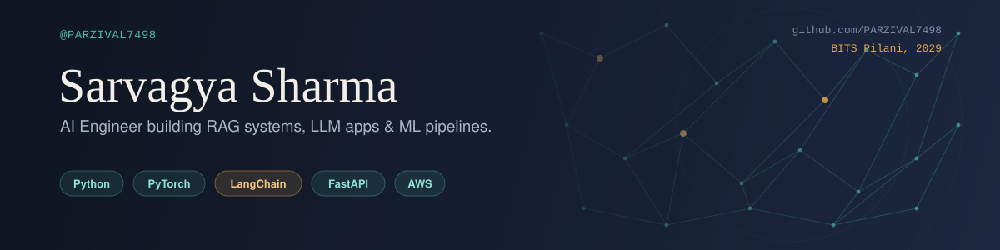

  

 

## 💫 About Me

🔭 I'm currently working on: AI/ML projects, RAG systems, and intelligent applications
👯 I'm looking to collaborate on: Open-source AI/ML projects and innovative developer tools
🤝 I'm open to connecting and collaborating.

## 🌐 Socials

  
  

## 💻 Tech Stack

  

 

## 📊 GitHub Stats

<table align="center">
  <tr>
    <td valign="top" width="50%">
      
    </td>
    <td valign="top" width="50%">
      
    </td>
  </tr>
</table>

  

 

Proudly created with <a href="https://gprm.itsvg.in">GPRM</a>

